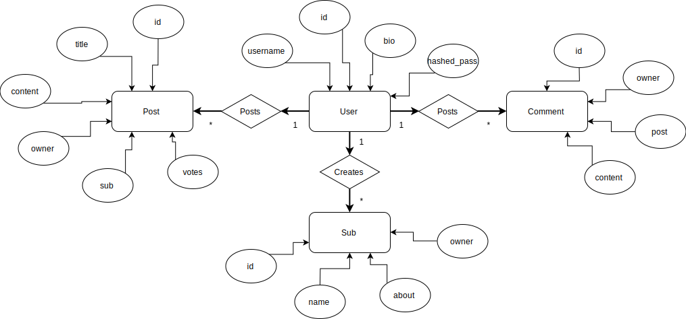

# slutprojektvt19webbserver

# Projektplan

## 1. Projektbeskrivning
Forum likt Reddit där man bl.a. kan skapa subs, posts, kommentarer och ha en profilsida.

## 2. Vyer (sidor)
### Alla vyer (layout)
- Lista av subs
- Navbar
- Footer

### /register
- Registrering av användare

### /login
- Inloggning

### /
- Lista av alla posts på hemsidan

### /sub/:id
- Lista av posts i subben
- Info om subben

### /post/:id
- Visa post
- Titel
- Content
- #### Info
    - Antal röster
    - Post author

### /post/:id/edit
- Ändra post

### /user/:id
- User bio

### /sub/:id/post
- Skapa post

### /sub/create
- Skapa sub

### /sub/:id/edit
- Ändra på infon om en sub

### /user/:id/edit
- Ändra "about me" på ens profil

### /post/:id/comment
- Kommentera på post

## 3. Funktionalitet (med sekvensdiagram)

Resterande funktionalitet beskrivs under vyer.

## 4. Arkitektur (Beskriv filer och mappar)
- ### db
    - Innehåller databasen 'db.db'
- ### public
    - #### css
        - Innehåller CSS för alla sidor ('styles.css')
- ### views
    - View-delen av MVC
    - Innehåller alla sidor i slim
    - 'layout.slim' bestämmer grundlayouten för varje sida
    - Resterande slim filer är för var sin sida
- ### misc
    - Innehåller filmen för webbsidans funktionalitet ('website_functionality.mp4')

- 'app.rb' är Controller-delen av MVC och har koden för alla routes
- 'db.rb' är Model-delen av MVC och har koden för interaktionen med databasen
- 'ER.svg' och 'Sequence Diagram.png' är ER diagrammet respektive sekvensdiagrammet
- ('README.md' är den här filen)

## 5. (Databas med ER-diagram)
